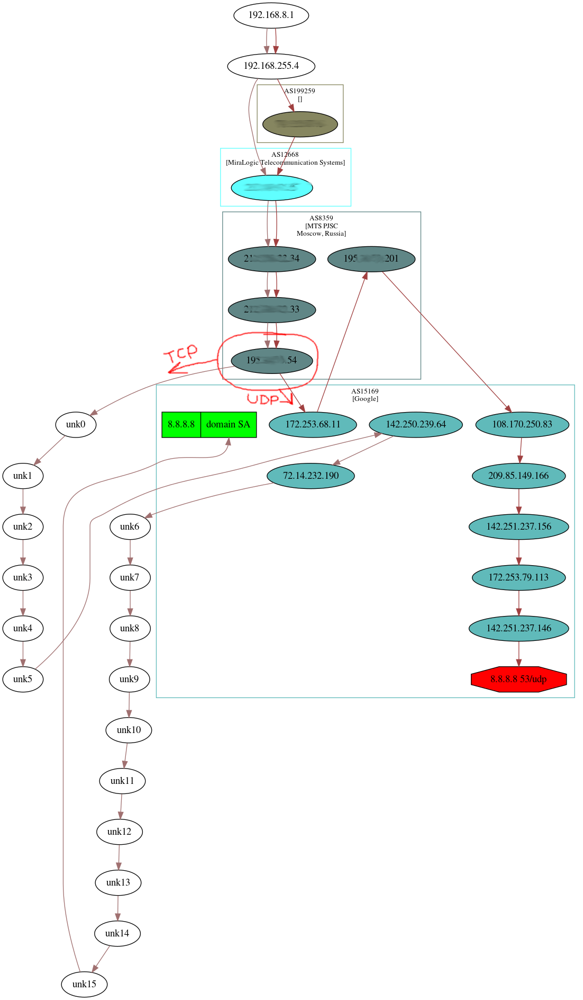

### path_discover.py
Visual traceroute in graph form.

```
sudo ./path_discover.py
8.8.8.8 53 tcp
8.8.8.8 53 udp
ctrl-D
```

Shows the path of the packet in the direction of each port.



We can see that TCP and UDP packets going to the same port are moving along different routes.
