### arp_scan.py
Finds hidden hosts in current subnet.

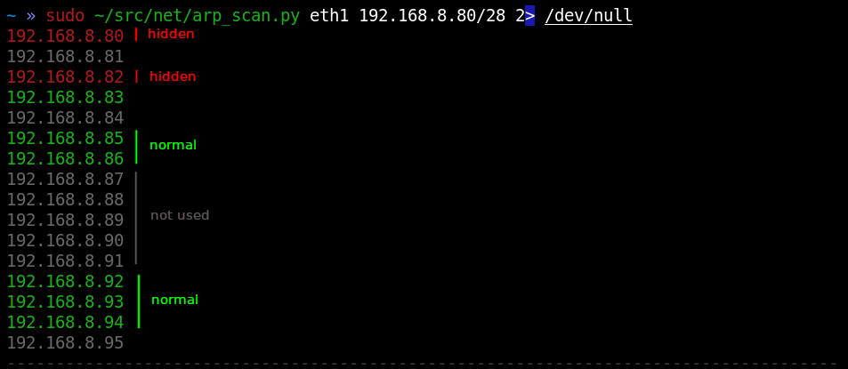

### arp_snac.py
Analyze stale information threads in current subnet.

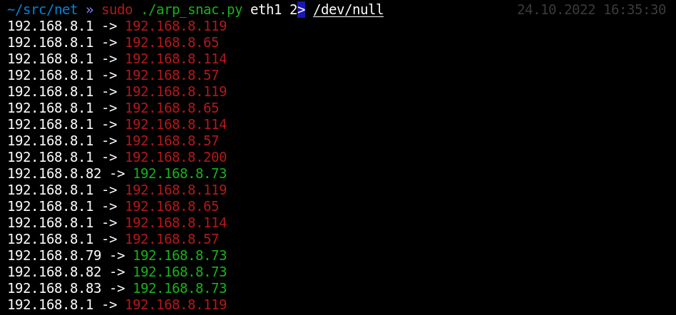

The script will automatically update the graph.

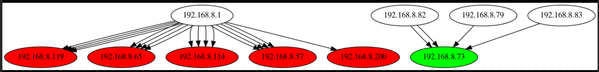

### arp_cage.py
Isolate host in current subnet.

`sudo ./arp_cage.py eth0 10.0.0.0/24 10.0.0.10`

### dhcpd.py
Just simple implementation of dhcp-server.

### dpi.py
Simple example of using wireshark lib for packets parsing.

### frag.py
Fragrouter. It will recreate packets with fragmentation for firewall testing.

```
sudo ./frag.py eth0 10
nc target port
```

### icmp_ts.py
Obtain local time from the remote host via ICMP packet.

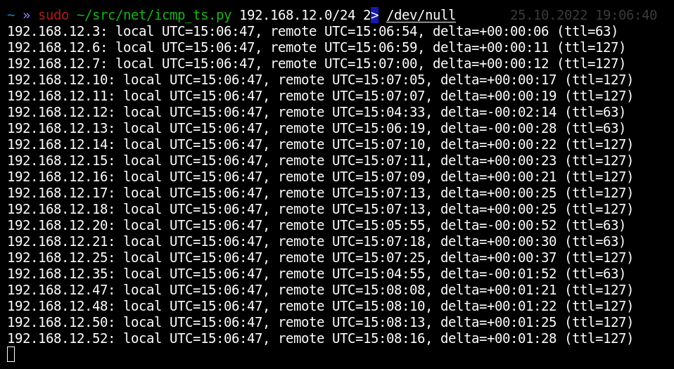

### tcp_analyze.py
Performs network usage analyze of targets machine by IP.id and obtaint system uptime.

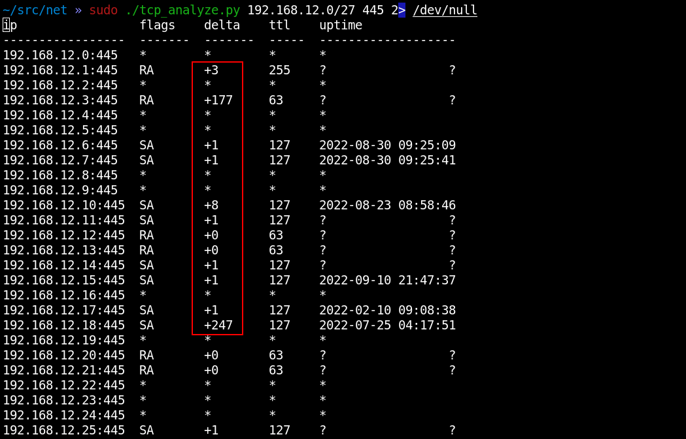

It may be very usefull for your targets understanding.

### tcp_analyze_group.py
Performs a grouping of targets into real servers by system uptime.

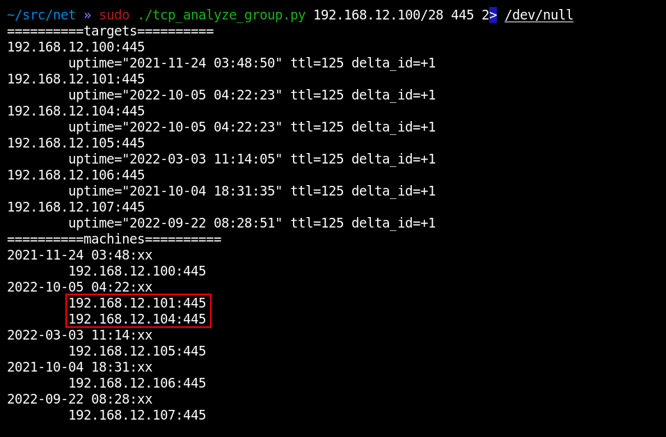

It may be very usefull for your targets understanding.

### traceroute.py
Power traceroute with arbitrary L4-packet on steroids:
* perform geoip-lookup of each hop
* perform whois-lookup of each hop
* determine delta IP.id for measurement network usage every hops

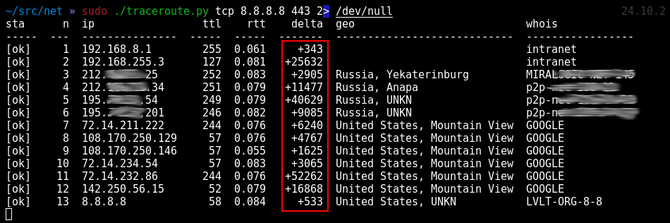

### tracebuster.py
Finds a hidden paths in your network.

For example, collects a 3-hops uniq paths for each /24-subnetwork via 80/tcp packets:

`sudo ./tracebuster.py 3 tcp 172.16.0.0/12 80`

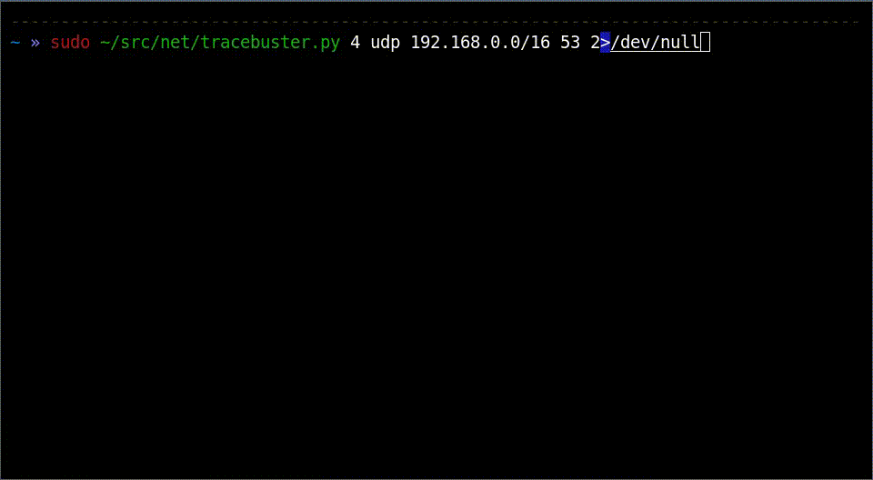

In result it generate dot-graph of discovered topology:

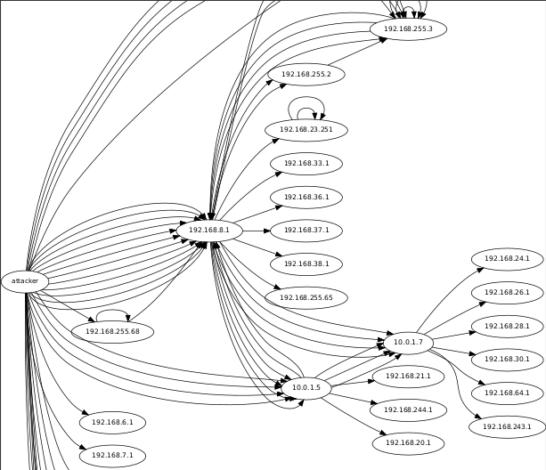

### path_discover.py
Visual traceroute in graph form.

```
msf> services -c port,proto
sudo ./path_discover.py
8.8.8.8 53 tcp
8.8.8.8 53 udp
ctrl-D
```

Shows the path of the packet in the direction of each port.

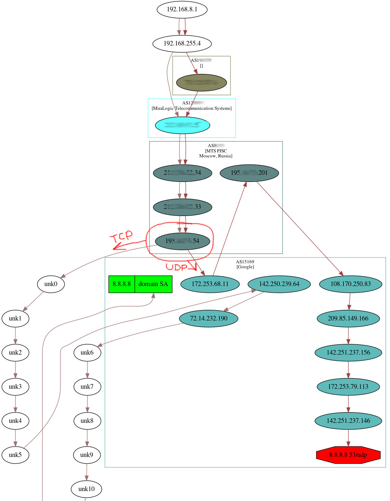

We can see that TCP and UDP packets going to the same port are moving along different routes.

### path_discover_group.py
Visual traceroute in graph form with grouping by servers (by system uptime).

```
msf> services -c port,proto
sudo ./path_discover_group.py
8.8.8.8 53 tcp
8.8.8.8 53 udp
ctrl-D
```

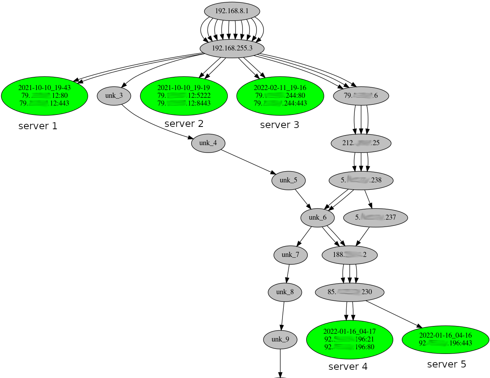

Utility determines belongings of ports to real servers.

### rr_test.py
Leak of path through network interfaces address.

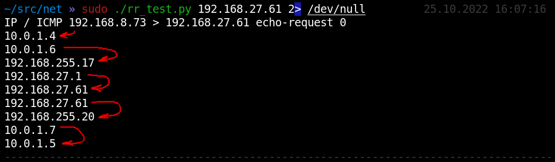

### lsrr_test.py
Attempt to change packet routing via `Loose Source and Record Route`.

`sudo ./lsrr_test.py 10.0.0.10 10.0.1.0/24`
